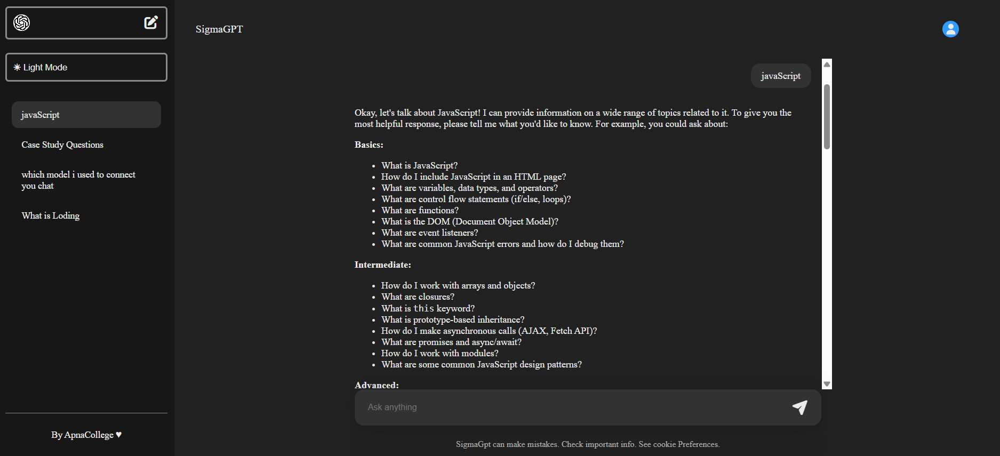
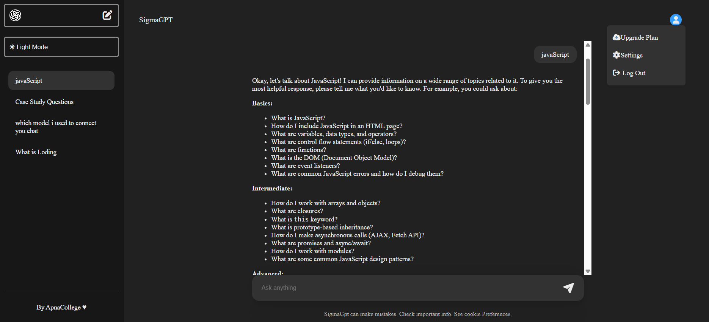

🚀 <strong><u>SigmaGPT Pro</u></strong>

SigmaGPT Pro is a full-stack AI chat application inspired by ChatGPT.
It allows users to communicate with an advanced Large Language Model (LLM) using a clean, modern interface.

### ✨<strong><u>The application supports</u></strong> 
-Secure authentication 
-Persistent chat history 
-Multiple conversation threads 
-AI-powered responses 
-Modern UI with dark/light mode 

<strong><u>This project is specially designed for:</u></strong> 
-🔥 Placement preparation 
-💼 Portfolio showcase 
-🧠 Real-world MERN stack learning 
-🤖 AI integration practice 

✨ <strong><u>Key Features:</u></strong> 
-🤖 AI chat powered by Groq LLaMA 3.3 (70B) 
-🔐 Secure JWT Authentication (Signup / Login) 
-🧵 Multiple chat threads (create, switch, delete) 
-💾 Persistent chat history using MongoDB 
-🌙 Dark / Light mode toggle 
-📱 Responsive sidebar (mobile friendly) 
-🧠 Context-based state management (React Context API) 
-⚡ Fast REST APIs with Express.js 

🛠 <strong><u>Tech Stack</u></strong> 

<b><u>Frontend:</u></b> 
-React (Vite) 
-JavaScript (ES6+) 
-CSS 
-Context API 
-Font Awesome Icons 

<strong><u>Backend:</u></strong> 
-Node.js 
-Express.js 
-MongoDB 
-Mongoose 
-JWT Authentication 
-bcryptjs 

<strong><u>AI Integration:</u></strong> 
-Groq API 
-Model: llama-3.3-70b-versatile 

🔐 <strong><u>Authentication Flow:</u></strong> 
-User registers or logs in 
-JWT token is generated on backend 
-Token is stored in localStorage 
-Protected APIs are accessed using Authorization: Bearer <token> 

## 📸 <strong><u>Usage Screenshots</u></strong>

<table>
  <tr>
    <td align="center">
       
      <b>Login Page</b>
    </td>
    <td align="center">
       
      <b>Signup Page</b>
    </td>
  </tr>

  <tr>
    <td align="center">
       
      <b>Chat Threads</b>
    </td>
    <td align="center">
       
      <b>Dark Mode</b>
    </td>
  </tr>

  <tr>
    <td align="center" colspan="2">
       
      <b>AI Response Generation</b>
    </td>
  </tr>
</table>

🧠 <strong><u>How AI Chat Works:</u></strong> 
-User sends a message 
-Message is stored in MongoDB 
-Message is sent to Groq AI 
-AI reply is received 
-Assistant reply is stored & returned to frontend 

⚙️ <strong><u>Environment Variables:</u></strong> 
Create a .env file inside Backend: 
-GROQ_API_KEY=your_groq_api_key 
-MONGODB_URL=your_mongodb_connection_string 
-JWT_SECRET=your_jwt_secret 

🚀 <strong><u>Installation & Setup:</u></strong> 
-Node.js installed 
-MongoDB running (Atlas or local) 
-npm or yarn 

<strong><u>1)Clone Repository:</u></strong> 
-git clone https://github.com/YaseenMotlani/SigmaGpt_Pro.git 
-cd SigmaGpt_Pro 

<strong><u>2)Backend Setup:</u></strong> 
-cd Backend 
-npm install 
-npm start 
Backend will run on: 
-http://localhost:8080 

<strong><u>3)Frontend Setup</u></strong> 
-cd Frontend 
-npm install 
-npm run dev 
Frontend runs on: 
http://localhost:5173 

🔮 <strong><u>Future Enhancements:</u></strong> 
-📂 Chat export (PDF / TXT) 
-🧑 User profile management 
-🧠 Conversation summarization 

📄<strong> <u>License </u></strong> 
-Licensed under the MIT License. 

👤 <strong><u>Author</u></strong> 
-<strong><u>Yaseen Motlani</u></strong> 
--<strong>GitHub:</strong> https://github.com/YaseenMotlani 
--<strong>Live Demo:</strong> https://sigmagpt-frontend-6tzj.onrender.com 

-

